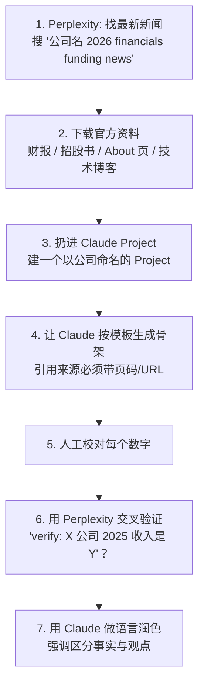
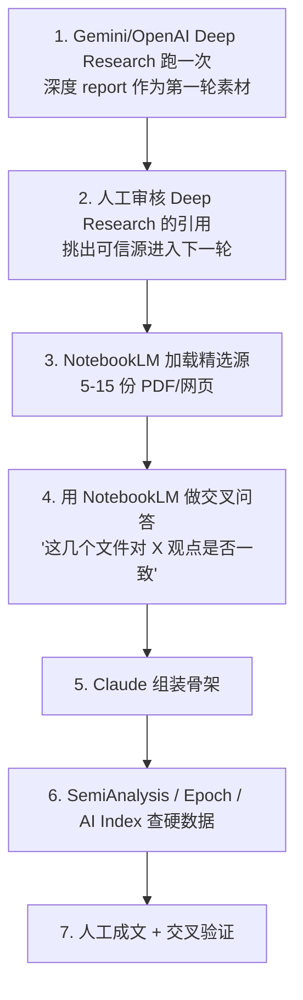
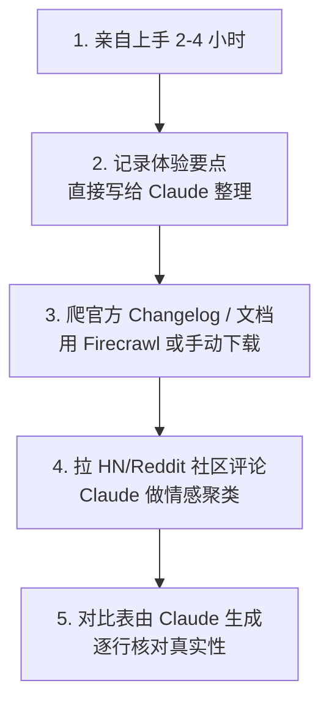

# 用 AI 辅助行业研究的工作流

> 最后更新：2026-04-22

## 摘要
行业研究是 AI 能帮到最多的场景之一——但也是**最容易被 AI 带偏**的场景（模型爱编数字、编人物、编事件）。本文给出一套**分工式工作流**：哪类任务交给哪个 AI，哪类任务必须手动，以及几个具体 prompt 模板和反幻觉校验流程。

## 一条铁律：AI 不碰"数字、人名、时间"

**永远不要相信 AI 直接生成的**：
- 具体数字（营收、估值、融资、市占率、员工数）
- 具体人名（"XX 是 YY 公司 CTO"）
- 具体时间（"2024 年 3 月 XX 发布了 YY"）
- 具体 URL

这些**必须**从原始出处复制粘贴（财报 PDF、官方新闻稿、官网 About 页）。AI 用来**组织**信息，**不用来提供**信息。

## 工具分工

| 能力 | 首选工具 | 次选 | 不用于 |
|---|---|---|---|
| 宽泛主题综述（"XX 行业是干什么的"） | Claude / GPT-5 | Gemini | 具体数字 |
| 网络检索（实时事件、最新新闻） | **Perplexity** / **ChatGPT Search** | Grok | 长文合成 |
| 深度研究（5-10 分钟自动跑） | **OpenAI Deep Research** / **Gemini Deep Research** | Perplexity Deep Research | 不核查就引用 |
| 多文档综合（你扔 20 份 PDF 给它读） | **Claude Projects** / **NotebookLM** | ChatGPT Projects | 生成新事实 |
| 长文撰写与校对 | **Claude** (Opus / Sonnet 4.6+) | GPT-5 | — |
| 论文/学术综述 | **NotebookLM** + Perplexity Academic | Elicit / Consensus | — |
| 结构化表格提取 | **Claude** + artifacts | ChatGPT Canvas | — |
| 中文一线信息 | **Kimi 探索版** / **豆包** | DeepSeek | 海外最新 |
| 专利检索 | Google Patents Advanced | — | AI 总结（必须读原文） |

## 典型工作流

### A. 写一家公司的调研文章



**Claude Project 配置建议**：
- Project Name = 公司名（如 "Anthropic Research"）
- System Prompt =
  ```
  你是一名行业研究分析师。在回答关于 [公司名] 的问题时：
  - 每条事实性陈述都必须在回答末尾标注来源（必须是我提供的文件）
  - 不要从你的训练数据生成具体的财务数字或日期
  - 如果文件里没有，直接说"文件中没有提到"
  - 用中文回答
  ```
- 文件：财报 PDF、招股书、官方技术博客 markdown、创始人访谈 transcript

### B. 写一篇行业研究文章



**Deep Research 工具横评（当前）**：

| 工具 | 长处 | 短处 |
|---|---|---|
| **OpenAI Deep Research** | 覆盖广、引用多、报告结构好 | 经常引学术论文中立场明显的片段，需人工筛 |
| **Gemini Deep Research** | 速度快、免费额度多、Google 原生搜索权重高 | 中文源明显少 |
| **Perplexity Deep Research** | 写作风格好，引用 UI 好 | 深度不如前两者 |
| **Grok DeepSearch** | 实时 X/Twitter 整合独一份 | 除 X 外的源质量一般 |

**我的选法**：海外公司/技术话题 → OpenAI Deep Research；中文市场话题 → Perplexity + Kimi 探索版 + 券商研报；快速验证某件事 → Perplexity 普通模式。

### C. 写一篇产品调研文章



**关键点**：产品调研**必须**亲自用过。没用过就写"以下基于公开材料"，不要冒充实操。

## Prompt 模板库

### 模板 1：公司骨架填充

```
根据我上传的 [公司名] 材料（财报 / 招股书 / 官方技术博客 / 访谈），按以下结构输出初稿：

1. 公司速览（创立时间、创始人、员工规模、最新估值——每个数字必须引用文件页码）
2. 历史沿革（只列 5 个关键转折点，每个要有：时间、事件、影响）
3. 业务与产品（按收入贡献从大到小排序，标注来源）
4. 技术路线（核心模型/技术差异化，必须有原文引用）
5. 商业模式（定价、客户集中度、收入结构）
6. 竞争与壁垒（3 个直接对标 + 护城河清单）
7. 关键风险（监管、技术、商业、人才，各 1 条）
8. 信息源清单

约束：
- 每条事实必须带来源（文件名#页码 或 URL）
- 文件里没有的事实，写"[待查证]"
- 我的观点单独放在最后一段，标注"观点"
```

### 模板 2：行业格局 mapping

```
主题：[行业名] 的竞争格局

我上传了以下材料：
- Stanford AI Index 2026
- State of AI 2025
- 2-3 份券商深度研报
- 3-5 家头部公司最新财报

请按以下结构输出（每条引用来源）：

1. 行业定义与相邻领域的边界
2. 价值链图（上游/中游/下游，每一环主要玩家 + 估算毛利）
3. 市场规模（2023-2025 实际 + 2026-2028 预测，标明每个数字来源）
4. 头部玩家（按收入 / 估值 / 月活 各排一次）
5. 近 12 个月关键变化（产品发布、融资、并购、监管）
6. 未来 12-24 个月关键变量

输出用 Markdown 表格，不要用散文。
```

### 模板 3：产品横评

```
输入：[产品 A] vs [产品 B] vs [产品 C]

每个产品我上传了：官网产品页 HTML、Changelog、3 条 HN 热帖、1 个 YouTube 深度评测 transcript。

请按以下结构对比：

1. 定位一句话（每个产品）
2. 能力覆盖矩阵（功能维度 × 3 个产品的 ✅/❌）
3. 定价对比表
4. 典型用户评价（引用原文）
5. 我的倾向（如果我是 [某种用户]）

约束：只引用我提供的材料，不要使用你训练数据中的产品知识。
```

## 反幻觉校验流程

写完一篇文章，在发布前过这个清单：

- [ ] 所有数字都能回查到原始 PDF / 网页的具体行
- [ ] 所有人名 title 都查过官方 LinkedIn 或公司官网
- [ ] 所有时间（发布日期、融资日期）都从公告 / 新闻稿确认
- [ ] 所有 URL 都实际点一遍，确认不是 AI 编的
- [ ] 文中标明"观点"的段落清晰区分于事实陈述
- [ ] 至少两处独立来源相互印证关键结论
- [ ] 无 markdown 格式错误、无繁简混杂

**快速检查技巧**：
- 把成文扔给 Claude：`以下文章中有哪些可能是幻觉的事实？列出需要我去核实的 10 个点。`
- 扔给 Perplexity：`verify: [关键事实]`
- 扔给 Kimi / DeepSeek 做中文源交叉：对中国公司尤其重要

## 工作流中的工具调用频率（按我个人使用）

| 频率 | 工具 |
|---|---|
| **每天** | Perplexity、Claude Desktop（Projects） |
| **每周 2-3 次** | NotebookLM、OpenAI Deep Research |
| **每月** | Gemini Deep Research、Kimi 探索版、Grok DeepSearch |
| **按需** | Elicit、Consensus（学术专用） |

## 常见踩坑

1. **直接让 AI "写一篇 Anthropic 的调研文章"**——100% 会编数字。要**先给素材**再让它写。
2. **迷信 Deep Research 的引用**——引用存在不代表引用**支持你要说的观点**。要点开每条引用读。
3. **用 AI 翻译英文报告**——Claude/GPT 翻译质量高，但**专业术语**（特别是金融、法律）偶尔会错。
4. **用 AI 直接做市场规模测算**——AI 不会做自下而上建模，它只会复述别处看到的数。
5. **同一问题只问一个 AI**——多问几个交叉比对成本不高，但能显著降低被单一模型偏见带偏。

## 延伸阅读
- [一手信息源清单](一手信息源清单.md)
- [常用行业数据源](行业数据源.md)
- [如何做一次公司调研](如何做一次公司调研.md)
