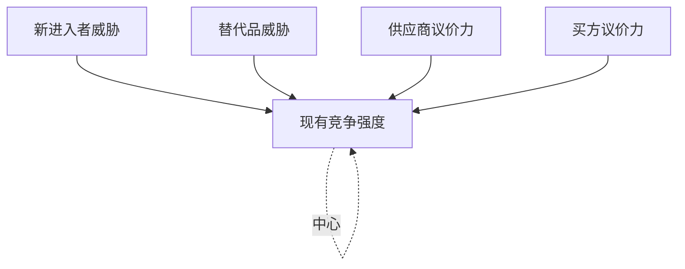
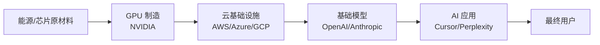

# 行业研究框架：SCP、波特五力、价值链

> 最后更新：2026-04-22

## 摘要
行业研究不是列事实，而是用**框架**让事实之间产生关系。本文介绍三个最常用、且互相补强的框架：**SCP**（结构-行为-绩效）用来看行业**演化**，**波特五力**用来看行业**吸引力**，**价值链**用来看**利润在哪个环节**。一份合格的行业研究至少用其中两个。

## 一、SCP 范式

**S**tructure → **C**onduct → **P**erformance：**结构决定行为，行为决定绩效**。

### S · 结构（Structure）
- 卖方集中度（HHI / CR4）
- 买方集中度
- 进入壁垒
- 退出壁垒
- 产品差异化程度
- 成本结构（固定 vs 可变）

### C · 行为（Conduct）
- 定价策略
- 产品策略（差异化 / 同质化）
- 营销与渠道
- 并购与联盟
- 研发投入

### P · 绩效（Performance）
- 毛利率、ROIC
- 增长率
- 行业整体利润分布
- 创新速度

**适用场景**：当你要回答"这个行业为什么会变成现在这样" / "未来结构变化会如何影响利润分布"——用 SCP。

**AI 行业的 SCP 速写示例**：
- **S**: 头部三家（OpenAI / Anthropic / Google）集中度极高，进入壁垒 = 算力 + 数据 + 人才
- **C**: 价格战（token 价格年降 80%）+ 产品升级（reasoning 模型、Agent）+ 垂直并购
- **P**: 头部毛利为负（研发折旧吞噬），腰部与开源追赶者分食长尾——**整个行业当前绩效不健康**

## 二、波特五力

五种力量共同决定行业**平均利润水平**：

### 每一力的关键问句

| 力量 | 关键问句 | AI 行业的答案（举例） |
|---|---|---|
| 现有竞争 | 玩家多少？增速？同质化？ | 极度拥挤、同质化高、价格战 → **强** |
| 新进入者 | 进入壁垒如何？规模经济？ | 算力+数据壁垒高，但开源削弱 → **中** |
| 替代品 | 替代方案是什么？ | 传统软件 / 人工 / 开源自建 → **中** |
| 供应商 | 上游集中吗？可替代吗？ | NVIDIA 极度强势、电力集中 → **强** |
| 买方 | 集中吗？转换成本？ | 开发者转换成本低、企业买方越来越懂行 → **渐强** |

**五力越强 → 利润越薄。** 当前 AI 行业五力几乎全部强——这就是为什么头部公司烧钱严重。

### 使用要点
- **不要得分就停**：每一力要写清**演化方向**（强-变强 / 强-变弱）。
- **结合替代品看新进入者**：开源模型本质上同时是"新进入者"和"替代品"。
- **不要滥用**：波特五力对**高度成熟的行业**更精确，对剧变中的行业只是参考框架。

## 三、价值链

**核心问题**：从**原材料**到**最终用户**，每一个环节吃掉多少利润？

### AI 行业价值链（示例）

每个环节都要回答：

1. 这个环节是**干什么**的？
2. 谁在这里？集中度？
3. 这个环节**毛利**是多少？
4. 钱从哪里来，去哪里？
5. 未来会不会被**上下游吃掉**或**自己吃掉别人**？

### AI 价值链的反直觉观察
- **GPU 厂**拿走最多绝对利润（NVIDIA 毛利 75%+）
- **云厂**靠 AI 承担 capex 但毛利不高
- **基础模型**亏损换市占，毛利甚至为负
- **应用层**毛利不错但规模受限
- 钱正在**加速流向最上游**——这不可持续但短期扭不过来

### 使用要点
- 画图时不要偷懒省略环节，**被忽略的环节往往是利润大头**（比如散热、光模块、液冷）
- **纵向一体化**的公司要拆开分析每段（Tesla 既是车厂又是芯片厂，价值链要拆开看）

## 四、三个框架如何配合

| 目标 | 首选框架 |
|---|---|
| 理解行业**为什么这样** | SCP |
| 评估行业**吸不吸引人**（投资 / 创业） | 波特五力 |
| 找**钱在哪里** | 价值链 |
| 预测**未来格局** | SCP + 价值链演化 |
| 看**某家公司的位置** | 价值链 + 波特五力（聚焦它所处环节） |

**一个推荐的组合流程**：

1. 先画**价值链**，识别利润分布
2. 用**波特五力**检查每个环节的竞争强度
3. 用**SCP** 预测结构变化会怎么改变上面两张图

## 五、常见的行业研究错误

1. **只有横截面，没有时间序列**：静态格局说服力弱，必须展示"过去 3 年变化"。
2. **信数据胜过信逻辑**：第三方咨询数据很多是拍脑袋，拿来印证而不是论证。
3. **只看美国 or 只看中国**：AI、机器人、金融都是全球性行业，缺一半视角=结论错。
4. **忽视监管变量**：金融、医疗、自动驾驶、出海——监管常常是第一位变量。
5. **把 PR 当 Vision**：公司路线图 PPT ≠ 真实方向。

## 延伸阅读
- [如何做一次公司调研](如何做一次公司调研.md)
- [一手信息源清单](一手信息源清单.md)

## 参考
- Michael Porter, *Competitive Strategy* (1980)
- Michael Porter, *Competitive Advantage* (1985)
- Richard Rumelt, *Good Strategy Bad Strategy* (2011)
